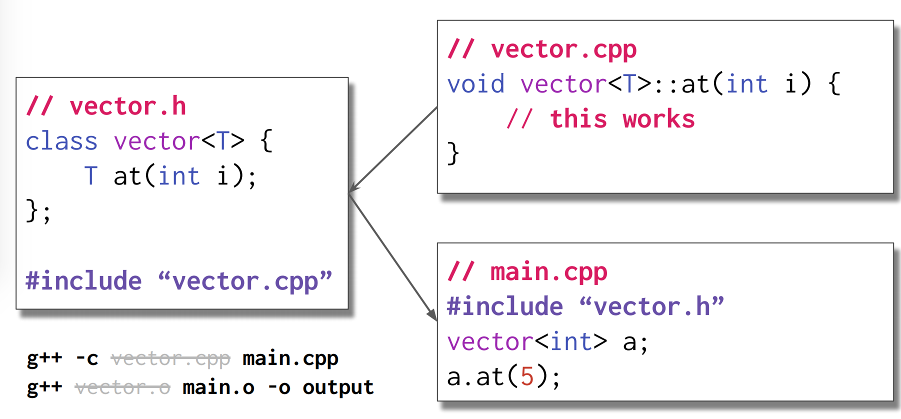
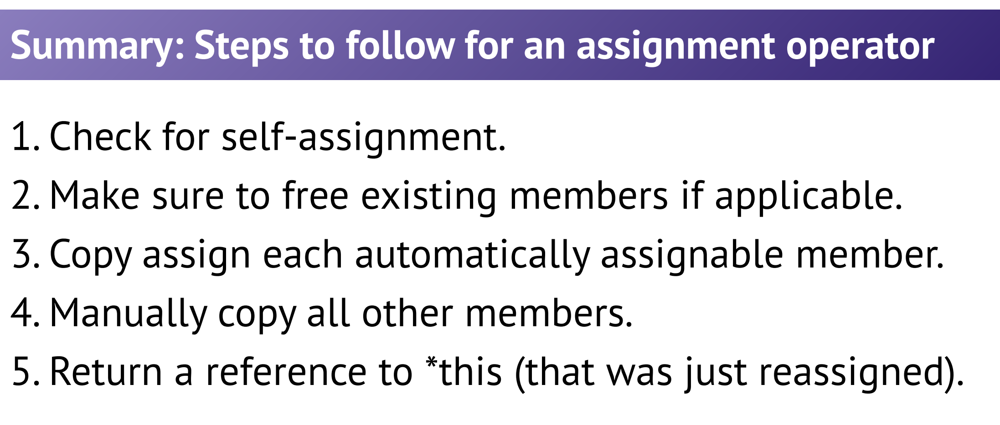
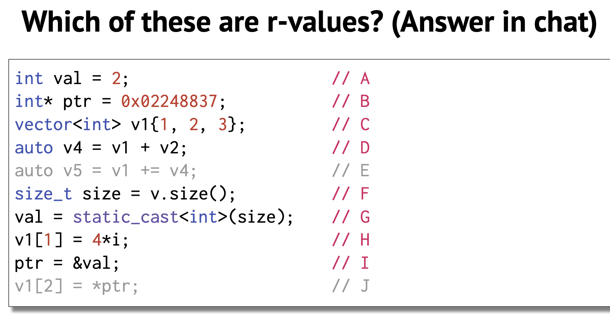

### Lecture 10: Classes I

#### File Layout




#### Type Aliases
```C++
using newType = oldType
```

#### Using Member Types

* Before class specifier, use typename.
```C++
template <typename T>
typename vector<T>::iterator vector<T>::insert(iterator pos,
int value) {
}
```

### Lecture 11: Const correctness

* If a function should be able to be called on a const object, it should be designated as const.


#### Summary of `const`
* const reference = a reference that cannot be used to modify the object that is being referenced.
* const method = a method of a class that can't change any class
variables and can only call other const methods.
* const object = an object declared as const that can only call its const methods.

>>Note: compiler will prefer the
non-const version if it’s not clear
which one is being invoked

#### `const_iterator`
`const_iterator` points to const objects,But the const_iterator object itself is not const,so we can perform `++` on a const_iterator but we cannot write to a const_iterator(`*iter=3`). A const iterator is a const object, cannot be reassigned but can write.


### Lecture 12: Operators

#### Member Functions
Member Function is a function with `this` as the left-hand side of expression. But non-member will not.


### Lecture 13: Special Member Functions

#### Special member functions
> Special member functions are (usually) automatically generated by the compiler

* default construction
* copy construction
* copy assignment
* destruction

```C++
 vector<int> vec1; //default construction
 vector<int> vec2(3);//Not a special member function
 vector<int> vec3{3};//uses initializer_list
 vector<int> vec4();//function declaration
 vector<int> vec5(vec2);//copy construction
 vector<int> vec6{};//default construction
 vector<int> vec7{vec3 + vec4};//copy construction
 vector<int> vec8 = vec4;//copy construction
 vec8 = vec2;//copy assignment
```




### Lecture 14：Move Semantics
A lvalue has an address (can do &), and a rvalue does not



`std::move` just forces anything to become a rvalue


```C++
template <typename T>
void vector<T>::push_back(const T& element) {
elems[_size++] = element; // equals → copy }
template <typename T>
void vector<T>::push_back(T&& element) {
elems[_size++] = std::move(element); // move! }
```

```C++
template <typename T>
void swap(T& a, T& b) noexcept {
   T c(std::move(a)); // move constructor
   a = std::move(b);  // move assignment
   b = std::move(c);  // move assignment
}

```
